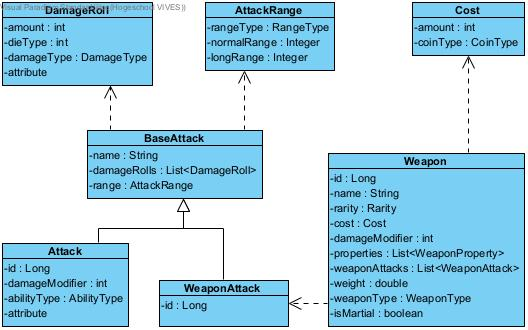
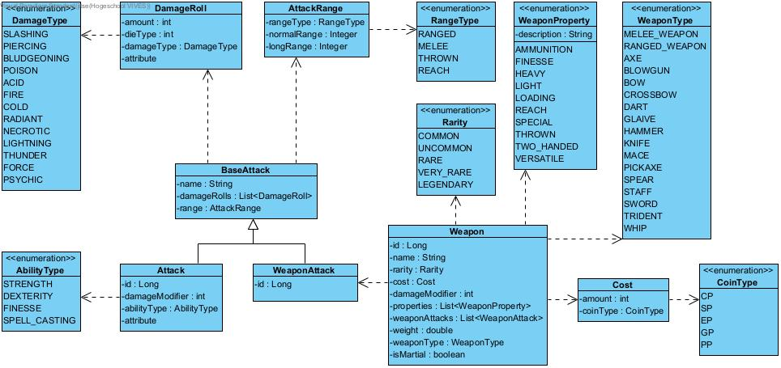

# Dnd weapons
Spring boot api die data aanbiedt voor een mobiele app.\
In de app kan een gebruiker informatie over de verschillende wapens raadplegen en de aanvallen van de wapens als template gebruiken om zelf aanvallen te maken.
Wanneer een dnd personage aanvalt dan kunnen deze aanvallen gebruikt worden om gemakkelijk de juiste schade te berekenen.
## Klassen
### Weapon
Elk wapen heeft 1 of meer aanvallen (WeaponAttack).
Deze worden in de app gebruikt als een soort template om zelf aanvallen aan te maken (Attack).
- id: id in de databank
- name: de naam van het wapen
- rarity: hoe zeldzaam het wapen is
- cost: de standaardprijs van het wapen
- damageModifier: een getal die de schade van alle aanvallen die het wapen uitvoerd beïnvloedt
- weaponAttacks: de aanvallen die een wapen standaard kan uitvoeren
- weight: het gewicht van het wapen (in pounds)
- properties: alle eigenschappen die een wapen bezit, elke eigenschap heeft een beschijving
- weaponType: welk soort wapen het is
- isMartial: wapens die martial zijn kunnen enkel effectief gebruikt worden door personages die hiermee ervaring hebben

### Cost
Stelt de prijs van een wapen voor.
- amount: het aantal munten
- coinType: de soort munt

### BaseAttack
Abstracte klasse die als basis dient voor Attack en WeaponAttack.
- name: de naam van de aanval
- damageRolls: lijst met de worpen die moeten gedaan worden om schade te berekenen
- range: de afstand waarop de aanval kan uitgevoerd worden

### WeaponAttack
Stelt een aanval voor die een specifiek wapen kan uitvoeren.
- id: id in de databank

### Attack
Stelt een aanval voor die niet aan een wapen vasthangt.
Dit is de klasse die gebruikt wordt voor de schade berekeningen in de app.
- id: id in de databank
- damageModifier: een getal die het aantal schade met een vaste waarde doet stijgen of dalen
- abilityType: de ability van een dnd character die bepaalt welke modifier gebruikt wordt van het personage die de aanval uitvoert

#### AbilityType
Een personage heeft verschillende abilities met elk een aparte modifier. AbilityType bepaald welke van deze modifier door de aanval gebruikt wordt.
- Strength: de kracht beïnvloed de schade
- Dexterity: de behendigheid beïnvloed de schade
- Spell casting: de magische kracht beïnvloed de schade
- Strength: de kracht beïnvloed de schade

### DamageRoll
Dit stelt een rol met een dobbelsteen voor.
- amount: het aantal keer er gerold word
- dieType: het aantal zijden dat de gerolde dobbelsteen heeft
- damageType: de soort schade die de gerolde schade aanbrengt

### AttackRange
Dit stelt de afstand waarop een aanval kan uitgevoerd worden.
Alle afstanden zijn in feet.
- rangeType: de soort range van de aanval
- normalRange: de afstand waarop een aanval zonder disadvantage kan uitgevoerd worden
- longRange: de maximale afstand waarop een aanval kan uitgevoerd worden

Enkel aanvallen met het type ranged of thrown hebben een normal en een long range. Als het type melee of reach is dan zijn deze velden null.

#### RangeType
- Melee: een aanval met een handwapen is (altijd 5ft)
- Reach: een aanval met een lang handwapen is (altijd 10ft)
- Ranged: een aanval met ammunitie
- Thrown: het wapen wordt geworpen

## Domeinmodel
### Domeinmodel zonder enums

### Volledige domeinmodel met enums

## Swagger documentatie
Alle endpoints zijn gedocumenteerd met swagger.\
https://dnd-weapons.azurewebsites.net/swagger

## Deployment
Gedeployd met Azure via een publieke repository.\
(de eerste request kan soms even duren omdat de deployment idle wordt)\
https://github.com/vanhaverbekejitse/dnd-weapons